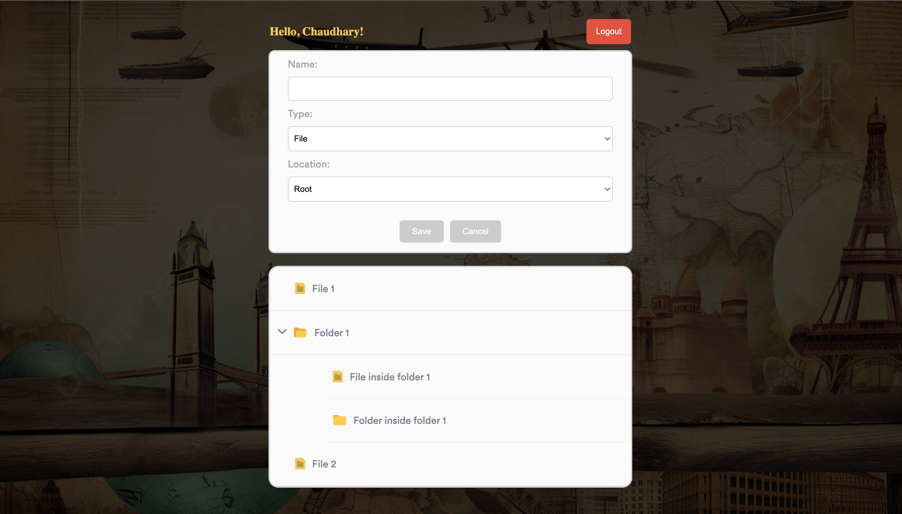
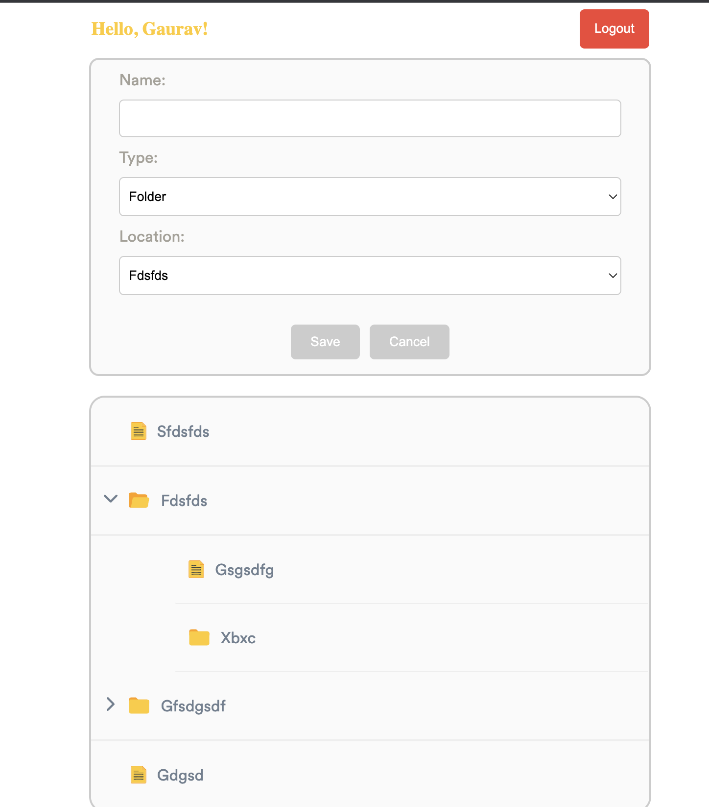

## Links

You can access the Filetree Navigator App and the File Folder Tree Component using the following links:

| App             | Link                                                                |
| ----------------- | ------------------------------------------------------------------ |
| Main App |  https://gaurav-filetree-app.netlify.app/ |
| Web Component | https://gaurav-filetree-webcomponent.netlify.app |

# Filetree Navigator App

The Filetree Navigator App is a web application that allows users to log in and visualise a file folder tree structure. It consists of a login page and a web component that displays the file tree.

## Login

Enter any name and password to login

## Screenshots

## Web component location

Web component JS is placed inside src/lib/
System JS was not used because of CORS error

## Setup Locally

To use the Filetree Navigator App or integrate the File Folder Tree Component into your project, follow these steps:

  1.  git clone https://github.com/gauravongit/file-tree-navigator.git
  2. cd file-tree-navigator
  3. npm install
  4. npm run dev
   

